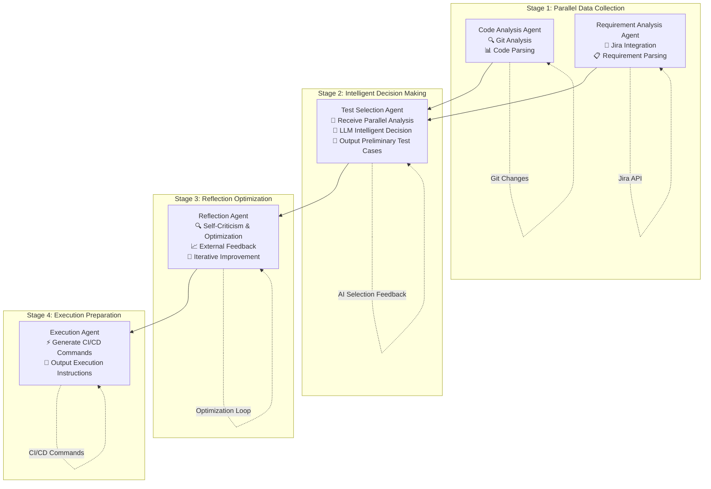
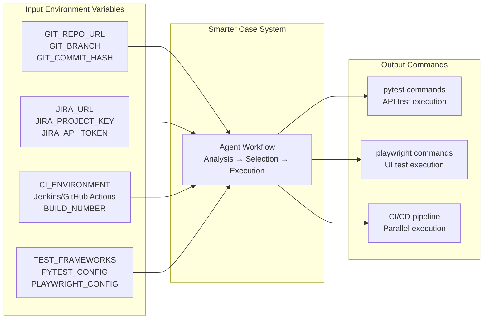

# Smarter Case - Intelligent Test Case Selection

An intelligent test case selection system for CI/CD pipelines using Agentic AI to optimize testing efficiency and coverage.

## 🚀 Features

- **Intelligent Test Selection**: AI-powered selection of test cases based on code changes and requirement analysis
- **Multi-Agent Architecture**: Collaborative coordination between specialized agents for optimal decision making
- **CI/CD Integration**: Seamless integration with GitHub Actions and Jenkins
- **Multiple Test Frameworks**: Support for Pytest (API testing) and Playwright (UI testing)
- **Reflection Design Pattern**: Self-improving algorithms through reflection and feedback loops
- **Real-time Monitoring**: Comprehensive metrics and monitoring capabilities

## 🏗️ Architecture

The system uses a collaborative coordination pattern with the following agents:

- **Code Analysis Agent**: Analyzes Git changes and identifies impact scope
- **Requirement Analysis Agent**: Fetches and analyzes requirement changes from Jira
- **Test Selection Agent**: Intelligently selects test cases based on analysis results
- **Reflection Agent**: Optimizes selections using reflection design patterns
- **Execution Agent**: Generates CI/CD execution commands

### Agent Collaboration Flow



### Agent Responsibilities

| Stage | Agent | Input | Output | Key Features |
|-------|-------|-------|--------|--------------|
| **Stage 1** | **Code Analysis** | Git commit hash | Code change analysis, impact scope | 🔍 Git Analysis, 📊 Code Parsing, ⚠️ Risk Assessment |
| **Stage 1** | **Requirement Analysis** | Time range, project key | Requirement changes, business impact | 🔗 Jira Integration, 📋 Requirement Parsing, 🎯 Priority Assessment |
| **Stage 2** | **Test Selection** | Parallel analysis results | Preliminary test case selection | 🤖 Receive Analysis, 🧠 LLM Decision Making, 📝 Test Case Filtering |
| **Stage 3** | **Reflection** | Test selection results | Optimized selection plan | 🔍 Self-Criticism, 📈 External Feedback, 🔄 Iterative Improvement |
| **Stage 4** | **Execution** | Optimized selection plan | CI/CD execution commands | ⚡ Generate Commands, 🚀 Platform Adaptation, 🔄 Parallel Execution |

### CI/CD Integration



### Required Environment Variables

| Category | Variables | Description |
|----------|-----------|-------------|
| **Git** | `GIT_REPO_URL`, `GIT_BRANCH`, `GIT_COMMIT_HASH` | Repository information |
| **Jira** | `JIRA_URL`, `JIRA_PROJECT_KEY`, `JIRA_API_TOKEN` | Requirement tracking |
| **CI/CD** | `CI_ENVIRONMENT`, `BUILD_NUMBER`, `WORKSPACE` | Pipeline context |
| **Testing** | `PYTEST_CONFIG`, `PLAYWRIGHT_CONFIG` | Test framework settings |

## 📋 Prerequisites

- Python 3.11.3+
- pyenv (recommended)
- Docker and Docker Compose (for containerized deployment)
- Access to Git repository
- Jira API access
- AI provider API keys (OpenAI, Anthropic, Google)

## 🛠️ Installation

### 1. Clone the repository

```bash
git clone <repository-url>
cd smarter_case
```

### 2. Set up Python environment

```bash
# Install Python 3.11.3 if not already installed
pyenv install 3.11.3

# Create virtual environment
pyenv virtualenv 3.11.3 smarter_case

# Activate virtual environment
pyenv local smarter_case

# Install dependencies
pip install -r requirements.txt
```

### 3. Configure environment variables

```bash
# Copy environment template
cp env.example .env

# Edit .env file with your configuration
nano .env
```

### 4. Set up data directories

```bash
# Create necessary directories
mkdir -p data/test_cases data/historical data/models data/cache logs
```

### 5. Project Structure

```
smarter_case/
├── src/
│   ├── agents/                 # Agent implementations
│   │   ├── code_analysis_agent.py
│   │   ├── requirement_analysis_agent.py
│   │   ├── test_selection_agent.py
│   │   ├── reflection_agent.py
│   │   ├── execution_agent.py
│   │   └── simple_agents.py    # Unified import interface
│   ├── coordination/           # Workflow orchestration
│   ├── config/                # Configuration management
│   ├── models/                # Data models
│   └── tools/                 # Utility tools
├── tests/                     # Test suites
├── examples/                  # Usage examples
└── config/                    # Configuration files
```

## 🚀 Usage

### Command Line Interface

```bash
# Run test selection workflow
python -m src.main --commit-hash abc123 --branch main

# Run with specific configuration
python -m src.main --config config/production.yaml

# Run in CI/CD mode
python -m src.main --ci-cd --pipeline github-actions

# GitHub Actions example
export GIT_REPO_URL="https://github.com/user/repo.git"
export JIRA_URL="https://company.atlassian.net"
export CI_ENVIRONMENT="github-actions"
python -m src.main --commit-hash $GITHUB_SHA
```

### Programmatic Usage

```python
# Option 1: Use workflow orchestrator (recommended)
from src.coordination.workflow_orchestrator import WorkflowOrchestrator

orchestrator = WorkflowOrchestrator()
result = await orchestrator.execute_workflow({
    'commit_hash': 'abc123',
    'branch': 'main',
    'time_range': '24h'
})

# Option 2: Use individual agents
from src.agents.simple_agents import (
    code_analysis_agent,
    requirement_analysis_agent,
    test_selection_agent
)

# Run individual agents
code_result = code_analysis_agent('abc123', 'main')
req_result = requirement_analysis_agent('24h', 'PROJ')
test_result = test_selection_agent(code_result, req_result)
```

## 🔧 Configuration

### Agent Configuration

Edit `config/agent_config.yaml` to configure agent behavior:

```yaml
agents:
  code_analysis:
    timeout: 300
    max_retries: 3
  test_selection:
    selection_algorithm: "intelligent"
    max_cases: 50
  reflection:
    max_iterations: 3
    improvement_threshold: 0.1
```

### CI/CD Configuration

Edit `config/ci_cd_config.yaml` to configure CI/CD integrations:

```yaml
github_actions:
  enabled: true
  token_env: "GITHUB_ACTIONS_TOKEN"
jenkins:
  enabled: true
  url: "http://jenkins.example.com"
  credentials_env: "JENKINS_API_TOKEN"
```

## 📊 Monitoring

The system provides comprehensive monitoring through:

- **Prometheus Metrics**: Performance and execution metrics
- **Grafana Dashboards**: Visual monitoring and alerting
- **Structured Logging**: JSON-formatted logs for analysis
- **Health Checks**: Automated health monitoring

Access monitoring at:
- Prometheus: http://localhost:9090
- Grafana: http://localhost:3000 (admin/admin)

## 🧪 Testing

```bash
# Run all tests
pytest

# Run unit tests only
pytest tests/unit/

# Run integration tests
pytest tests/integration/

# Run with coverage
pytest --cov=src --cov-report=html
```

## 🚀 Deployment

### Docker Deployment

```bash
# Build and run with Docker Compose
docker-compose up -d

# Run in production mode
docker-compose -f docker-compose.prod.yml up -d
```

### Manual Deployment

```bash
# Install production dependencies
pip install -r requirements.txt

# Run application
python -m src.main --production
```

## 📚 Documentation

- [Architecture Overview](docs/architecture.md)
- [API Documentation](docs/api.md)
- [Deployment Guide](docs/deployment.md)
- [Configuration Reference](docs/configuration.md)

## 🤝 Contributing

1. Fork the repository
2. Create a feature branch
3. Make your changes
4. Add tests for your changes
5. Submit a pull request

## 📄 License

This project is licensed under the MIT License - see the [LICENSE](LICENSE) file for details.

## 🆘 Support

For support and questions:
- Create an issue in the repository
- Check the [troubleshooting guide](docs/troubleshooting.md)
- Review the [FAQ](docs/faq.md)
